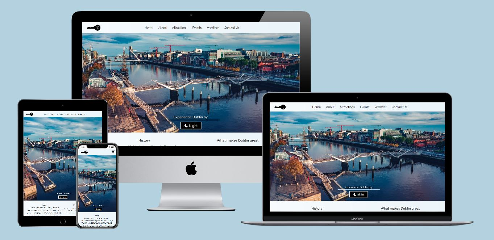
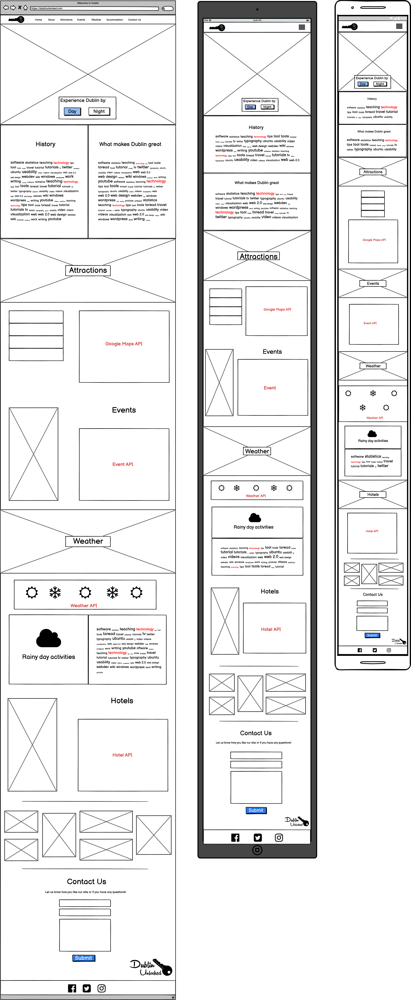

# Dublin Unlocked
<i>Your key to the city.</i>

Dublin unlocked is an interactive city guide for Dublin, Ireland. It offers value to both visitors and locals alike. 
It provides a live weather forecast, local events, and a map showcasing the best spots in the city. 
Dublin unlocked is the perfect replacement for a bulky traveller’s guidebook while you are on the go. 
Dublin unlocked is a fictious company with the slogan “Your key to the city”. 
The website maintains its design on devices of all screen sizes, so it can be enjoyed on the go or at home on your desktop.

[View the live project by clicking here](https://shanekeran.github.io/dublin-unlocked)

## User Experience (UX)
___
### Overview
I used user stories and the five planes of user experience design as a framework for planning the project.

### User stories

*As a site user, I want to*

- Access the website from any device and easily navigate the website.
- Be able to easily read all content and view all images displayed.
- Find suggestions for activities that I may enjoy and see the location of that activity.
- View the current five day forecast for the city.
- Discover upcoming events happening within the city.
- Have an option of contacting the owner of the site if I have any feedback on the content of the website.

*As a site owner, I want to*

- Provide accurate, up to date information that gives the user an incentive to return to the website for information in the future.
- Promote the city using eye-catching imagery displayed throughout the website.
- Allow the user to interact with the website if they choose to do so.
- To receive an email if a user submits a comment or feedback through the website’s contact form.
- To display a message to the user if one of the features fails to load, so that they can try again later.

### Strategy

The purpose of the website is to promote the city of Dublin and what is has to offer. 
It aims to be used as digital guidebook to help you navigate to the best spots in town, 
whether that be finding a popular restaurant or looking ahead at a collection of upcoming events. 
The target market of Dublin Unlocked is not restricted to any age group but instead 
is geared towards those who are outgoing and want to make the most of their time spent in Dublin.

After reviewing competitor websites, I noted the wide array of local attractions they had on display but more importantly a lack of information surrounding any type of events taking place. 
Ireland is renowned for its music and sense of humour so a key strategy to differentiate this website to its competitors will be to display upcoming concerts and comedy events by utilising the Ticketmaster API.

The strategy for the project is to implement the needs previously outlined in the user stories and to also meet the business goals.

The business goals which the website must fulfil are to increase brand awareness and loyalty. 
This can be achieved by taking new users to a splash page that displays the Dublin Unlocked logo and slogan as an introduction to the brand before they skip to the main content. 
On the main site they can also connect with the company on other social media platforms listed in the footer. 
If the website has a large user base that frequently returns to check for the latest information, then it will help drive B2B sales between Dublin Unlocked and local businesses who wish to list their business on the site.

### Scope

Features to be included on the website are:
- Dark mode toggle for the website that changes the background and font colour. As an extra it also displays night-time imagery and nightlife options in the attractions section.
- Buttons that the user can select for different attractions such as theatres and parks which open various recommendations on the adjacent map provided by the Google Maps API.
- A selection of six random upcoming events happening in Dublin. These will be displayed on cards or as a carousel depending on screen size.
- Five-day weather forecast showing conditions, temperature, and precipitation. 
- Animated photo gallery that moves from side to side.
- Contact form that sends an email to the site owner on submission.
- A cookie that ensures the splash page does not display for returning visitors.
- Parallax images.

Features to be introduced at a later date:
- The ability to browse and book available hotels in the area. 
This can be implemented when the website receives the minimum amount of traffic required to use the Booking API.
- Introduce a “Tours” section for booking tour tickets like some competitors offer.

### Structure

Dublin Unlocked is a single page website with 5 sections.

1. Home / About

    The Home section features the navigation bar, a large hero image, dark mode toggle button and written content for the city’s brief history and what makes it great.

2. Attractions

    The Attractions section contains four buttons for restaurants, theatres, parks, and attractions. 
    Each button displays a collection of recommendations pin-pointed on a map adjacent to the buttons.

3. Events 

    The Events section displays as either a photo carousel or as individual cards depending on screen size. 
    Each event displays the title, venue, date, and a link to Ticketmaster to find out more information. 
    The events are displayed randomly by the API so each time the user visits the site, there is a good chance they will discover a new event.

4. Weather 

    The Weather section shows the current five day forecast with the date, icon, weather conditions, temperature, and precipitation amount for each day. 
    As the weather is frequently displaying as rain, 
    I included some extra rainy-day activities below the forecast.

5. Contact Us

    The Contact section contains a form for feedback or comments to be submitted by the user. 
    On submission it sends an email to the site owner and displays a confirmation message to the user.

### Skeleton

I used Balsamiq to create a wireframe for each device. The wireframes were created in the planning stage, so the current version differs slightly.

### Surface

#### Colour
For my background color, I picked a linear gradient that subtly fades from white to light blue (**#eaf4f9**) with black as the font colour.

  

When dark mode is selected, the background colour changes to dark grey (**#3d3e3efc**) with a white font colour.

All the buttons have a standardised blue gradient colour. 

### Typography
I chose the Raleway font for my headings and Open Sans font for my content. 
I specified Sans-serif font to be used in their place if Google Fonts is unavailable. Both fonts were chosen for their readability and professional look.

### Design
The current version of the website does not include the Hotels section that featured in the wireframes, this will be added at a later date. 
Overall, I am very pleased with aesthetic of the entire page, especially the vivid imagery of Dublin and the ability to allow the user to experience that during day and night-time. 

## Technologies used
___
### Lanuages
- HTML5
- CSS3
- Javascript

### Frameworks, Libraries & Programs used
1. Git 

    Used for version control.

2. GitHub 

    Project files were pushed from Git to GitHub.

3. Gitpod

    I used Gitpod's dev environment to write the code for my project.

4. Bootstrap 5.0 

    Bootstrap was used to make a collapsible navigation bar, responsive flex containers for each section, 
    the cards and carousel for the Events section.

5. Google Fonts 

    Google Fonts was used to import Raleway and Open Sans into styles.css.

6. Font Awesome 

    Font Awesome was used to display various icons throughout the site.

7. Adobe Creative Suite 

    This was used to create the logos for Dublin Unlocked.

8. jQuery 

    jQuery in addition to Bootstrap, made the navbar responsive. 
    jQuery was also heavily used in the interactivity of the website, 
    specifically for the dark mode toggle and displaying information obtained from the APIs.

9. Balsamiq 

    Balsamiq was used to create the wireframe.

10. Imgur 

    I used Imgur to host most of my site images.

11. Unsplash 

    Unsplash was used to obtain free to use images of Dublin city.

12. Google Maps Javascript API 

    This API was used to display a map on the page with markers and info windows for each attraction.

13. Ticketmaster API 

    This API was used to display random upcoming event details and imagery.

14. Visual Crossing Weather API 

    This API was used to show a five-day forecast for Dublin, Ireland.

15. js-cookie  

    A custom cookie was used to determine whether to display the splash page or not.

16. EmailJS

    This was used to automatically send an email to the site owner on submission of the contact form.

## Testing
___

The W3C Markup Validator, W3C CSS Validator Services and jshint were used to validate the project to ensure there were no syntax errors.

### HTML Validation
Index.html and 404.html passed through the W3C HTML Validator with no errors.

### CSS Validation
My only external css file (style.css) passed through the W3C CSS Validator with no errors.

### Javascript Validation
All four external javascript files passed through jshint with no major issues.

### Testing the User stories

#### Site User
1. Access the website from any device and easily navigate the website.
    * With the help of measurements such as viewport width (vw) and viewport (vh), Bootstrap’s grid layout and 
    my usage of Media queries, Dublin Unlocked is responsive on all device sizes. 
    * I used responsinator to test the website on mobile, tablet, laptop, and desktop. 
    It maintained a good user experience on each.

2. Be able to easily read all content and view all images displayed.
    * All content is divided into easy to reach sections, with its font sized accordingly to the device you are using. 
    * Section content is short and bite-sized for an easy read. 
    * All images are sized correctly, with sufficient quality and maintain their original aspect ratio as close as possible.

3. Find suggestions for activities that I may enjoy and see the location of that activity.
    * Dublin Unlocked offers a selection of activity types, which are searchable using the buttons next to the map. 
    * On click of each button, the corresponding markers pin-pointed a list of recommendations on the map. 
    * On click of each marker revealed an info window with the name and a short description of that attraction.

4. View the current five day forecast for the city.
    * A five-day weather forecast displays in the weather section of the page. 
    * It lists the weather conditions, temperature, and precipitation amount for each day.

5. Discover upcoming events happening within the city.
    * Six random Ticketmaster events can be found in the Events section. Since these are taken from a randomised list, it may be 6 entirely different events when the user returns to the site.
    * The list of events displays correctly on each device tested. 
    * The user can also find more details by clicking on the CTA link which opens the Ticketmaster event in a new tab.

6. Have an option of contacting the owner of the site if I have any feedback on the content of the website.
    * A contact form is available in the Contact Us section. It requires a name, email address and a comment. 
    * On submission of the required inputs, it will display confirmation and send an email to the site owner.
    * When tested, I received an email in my personal email inbox with all the correct information.
    * The user can also connect with the company through their social media links in the footer.
        As this is a fictional company, I have linked my own social accounts as a filler.

#### Site owner
1. Provide accurate, up to date information that gives the user an incentive to return to the website for information in the future.
    * I have tested the Ticketmaster API and Visual Crossing API over several days, and there was always a collection of new events and an updated weather forecast available. 
    * I even found myself checking for new events every time I was working on other parts of the page, as it is interesting to see what shows up.

2. Promote the city using eye-catching imagery displayed throughout the website to allow the user to visualise the beauty of Dublin.
    * I used a large hero image on the home page to greet the user with a scenic view of the city.
    * All images displayed throughout the site were captured in Dublin or surrounding areas.
    * I also included a gallery separating the weather and contact section, which is animated to move from side to side. It is made up of many images 
        and it certainly catches your eye while scrolling the page.

3. Allow the user to interact with the website if they choose to do so.
    * There are several ways the user can interact with the website.
        * Clicking the enter button on the splash page to enter the main content.
        * Toggling between Day and Night(dark) mode.
        * Clicking the attractions buttons to show recommendations.
        * Clicking the next or previous controls on the event photo carousel.
        * Submitting the contact form.
    * All interactive controls have been tested and are working correctly.

4. To receive an email if a user submits a comment or feedback through the website’s contact form.
    * EmailJS is used to send the site owner an email on submission of the form. 
    * I have tested the form and received the information in my personal email inbox.

5. To display a message to the user if one of the features fails to load, so that they can try again later.
    * I have implemented and tested that when:
        *  The Ticketmaster API fails to load, the following message appears “Ticketmaster API loaded successfully”.
        *  The Visual Crossing API fails to load, the following message appears”Visual Crossing API loaded successfully”.
    * There is also a custom 404 page to redirect users back to the home page without having to use the browser back button.

### Further Testing

- Website has been tested on the following browsers, using the latest version available: Chrome, Safari, Edge and Firefox. The tests were successful.
- All internal and external links on the website have been tested and work as intended. Tested by clicking every link on each page.
- I used Lighthouse to test each page for accessibility and performance.
    * [Desktop](assets/documents/lighthouse-desktop.jpg)
    * [Mobile](assets/documents/lighthouse-mobile-jpg)

    I'm delighted to see such high results for accessibility, best practices and SEO. I'm also happy with my high performance on desktop but unfortunatelt performace on mobile is quite low,
    at just above 50. Since the website contains a lot of images, even with lazy-loading and other tactics, I was unable to get this higher at present.

### Known Bugs and Fixes
List below are some of the more time-consuming bugs I encountered while creating Dublin Unlocked.

1. The gallery animation would come away from the side of the page on larger screens. 
    This was resolved by increasing photo size, changing the container width to “max-content” 
    and decreasing the animation movement as the screen size gets wider.
    

    
Click here to view a screenshot.

    
    

2. Animated gallery displaying incorrectly on some browsers. 
    This was fixed by removing the webkit vender prefix on the animation properties.

3. Parallax images displaying incorrectly on Safari. 
    Image was static, zoomed in and pixelated. Fixed by adding in code found on Stack Overflow. 
    Background-attachment: fixed is not supported so It was replaced with background-attachment: scroll.

4. Events duplicating
    At first, I displayed the most recent upcoming events in Dublin but since Ticketmaster listed the same event multiple times but for different ticket types, it meant that 3/6 events could be the same performer.
    I remedied this by adding the random parameter to the API URL.

5. Visual Crossing API not loading occasionally
    Sometimes when the page is loaded, the weather forecast does not display until you refresh the page. I added a display message to alert the user to try again later to remedy this until it can be resolved. 
    My mentor advised that this can be a known issue with free APIs.

6. Google Maps API 
    I removed the async attribute to allow the API more time to connect and this seems to have made the issue much less frequent.
    This is another issue I plan to properly address in the future when I find a better solution.

## Deployment
___
### Github

This project is deployed using GitHub pages using the following process,

### Deploying a GitHub Repository via GitHub Pages

1. In your Repository section, select the Repository you wish to deploy.
2. In the top horizontal Menu, locate and click the Settings link.
3. Inside the Setting page, scroll down to locate the GitHub Pages Section.
4. Under "Source", select the None tab and change it to "Master" and click Save.
5. Finally once the page resets scroll back down to the GitHub Pages Section to see the following message "Your site is ready to be published at (Link to the GitHub Page Web Address)". It can take time for the link to open your project initially, so please don't be worried if it down not load immediately.

### Forking the Github Repository

You can fork a GitHub Repository to make a copy of the original repository to view or make changes without it affecting the original repository.

1. Find the GitHub repository.
2. At the top of the page to the right, under your account, click the Fork button.
3. You will now have a copy of the repository in your GitHub account.

### Making a Local Clone

1. Log in to GitHub and locate the GitHub Repository
2. Click the "Code" button and a dropdown menu will appear.
3. To clone the repository using HTTPS, under "Clone with HTTPS", copy the link.
4. In Gitpod, change the directory to the location you would like the cloned directory to be located.
5. Type "git clone", and paste the link you copied in step 3.
6. Press Enter to have the local clone created.

## Credits
___
### Code

- Stack Overflow

    * [This thread](https://stackoverflow.com/questions/30102792/css-media-query-to-target-only-ios-devices) and comment by Jonathan Lin was used to fix parallax image issues on safari.](https://stackoverflow.com/questions/30102792/css-media-query-to-target-only-ios-devices)
    * [This thread](https://stackoverflow.com/questions/41587802/css-animation-from-left-to-right) was used to help setup my gallery animation.
    * [This comment](https://stackoverflow.com/questions/25445377/how-to-get-current-date-without-time) by immayankmodi was used to help me figure out how to convert epoch date to a dd/mm/yy format.
    * [This thread](https://stackoverflow.com/questions/19057513/toggling-an-image-src-with-jquery) helped me learn how to toggle between my two navbar logos.

- Bootstrap

    * [This bootstrap card template](https://bootsnipp.com/snippets/67z63) helped me create my event cards for smaller screens.
    * [Bootstrap documentation](https://getbootstrap.com/docs/5.0/getting-started/introduction/) was used for the photo carousel and navbar.

- w3schools

    * [How to use parallax](https://www.w3schools.com/howto/howto_css_parallax.asp)
    * [How to apply blurred/grayscale filter](https://www.w3schools.com/howto/howto_css_blurred_background.asp)
    * [How to clear an input field](https://www.w3schools.com/howto/howto_html_clear_input.asp)

- Code Institute

    * I implemented what I have learned over the last few months in the Full Stack Software Development course.

- YouTube

    * The following YouTube tutorials were helpful in creating this project.
        * [Google Maps Javascript API Tutorial by Traversy Media](https://www.youtube.com/watch?v=Zxf1mnP5zcw&list=LL&index=4&t=1437s)
        * [Send Email directly from JavaScript by Code with Voran ](https://www.youtube.com/watch?v=x7Ewtay0Q78&list=LL&index=1)

### Media

- Unsplash

    * [Custom House Quay by Gregory Dalleau](https://unsplash.com/photos/sIymDF_ebp8)
    * [Events photo by Bilal Zafar](https://unsplash.com/photos/dYzmjy2H_ws)
    * [Hellfire club by Rory Nolan](https://unsplash.com/photos/tH4i-Oag0h0)
    * [Killiney Hill by Lukas Medvedevas](https://unsplash.com/photos/JsILxY2o168)
    * [Events photo by Rachel Coyne](https://unsplash.com/photos/U7HLzMO4SIY)
    * [Christ Church by Jeremy Matteo](https://unsplash.com/photos/S_iNiotOU8U)
    * [Luas by Louis Hansel](https://unsplash.com/photos/NBsJsj8JFpM)
    * [Tower in Dublin by Lisa Fecker](https://unsplash.com/photos/iyNGrcIJ45U)
    * [Howth Lighthouse by Dimitry Anikin](https://unsplash.com/photos/Eh140CNVDp4)
    * [Convention Centre by Len Weincier](https://unsplash.com/photos/b3a9vhurdxo)
    * [Corner of a building by Jordan Harrison](https://unsplash.com/photos/DuCUimbpLhk)
    * [Dalkey Island by Lukas Medvedas](https://unsplash.com/photos/l6U8wjb7flY)
    * [Trinity college library by Alex Block](https://unsplash.com/photos/PdDBTrkGYLo)
    * [The Spire by Frank Huang](https://unsplash.com/photos/agaFqqfmm8I)
    * [Beacon by Kieran Sheehan](https://unsplash.com/photos/vgLjB0xB9ig)
    * [The Temple Bar by Matheus Camara da Silva](https://unsplash.com/photos/NL2ORrGh8KM)

- Pexel

    * [Bridge under the blue sky by Lucian Potlog](https://www.pexels.com/photo/bridge-under-the-blue-sky-3566187/)
    * [St Ann’s Church by Mark Dalton](https://www.pexels.com/photo/low-angle-photo-of-blue-concrete-building-1000283/)
    * [People walking on the street by Lukas Kloeppel](https://www.pexels.com/photo/photo-of-people-walking-on-street-2416653/)
    * [The Temple bar by Lucian Potlog](https://www.pexels.com/photo/assorted-liquor-bottles-3566226/)
    * [Beacon by Lucian Potlog](https://www.pexels.com/photo/light-sea-dawn-landscape-4554435/)
    * [Poolbeg towers by Lucian Potlog](https://www.pexels.com/photo/sea-landscape-nature-sky-4516247/)
    * [Colourful building by Mark Dalton](https://www.pexels.com/photo/person-standing-in-front-of-green-building-beside-road-at-daytime-1208783/)
    * [Malahide Castle by Barion McQueen](https://www.pexels.com/photo/grey-concrete-castle-on-green-grass-field-5002477/)
    * [Catherdral by Lucian Potlog](https://www.pexels.com/photo/city-road-sky-sunset-4403644/)
    * [Luas at night by Lucian Potlog](https://www.pexels.com/photo/light-city-road-traffic-4038899/)

- Clker

    * [Weather icons](http://www.clker.com/clipart-weather-symbols.html)

### Acknowledgements

- My mentor, Antonio Rodriguez, for his helpful feedback and guidance.

- My fellow Code Institute students for their suggestions.

- Tutor support at Code Institue, for answering my technical questions.